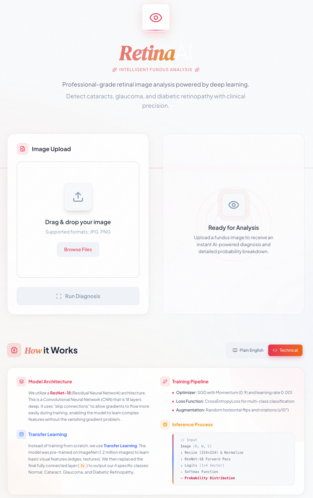

# Retina Fundus Classification

Lightweight pipeline to train a fundus image classifier (cataract, glaucoma, normal, diabetic retinopathy) with optional early stopping on validation accuracy.

**[Live Demo](https://fundus-dx-ml.vercel.app/)**



## Architecture

- **Frontend**: Hosted on [Vercel](https://fundus-dx-ml.vercel.app/). Built with React and Tailwind CSS.
- **Backend**: Hosted on Hugging Face Spaces. Serves the PyTorch model via FastAPI.
- **Model**: ResNet18 fine-tuned on fundus images.

## Local Development

### Setup
```bash
pip install -r requirements.txt
```
Python 3.10+ recommended; GPU or Apple Silicon preferred but CPU works.

### Prepare splits
```bash
python organize_data.py
```
Creates `data/processed/train` and `data/processed/val` with an 80/20 split per class (seeded for repeatability).

### Train
```bash
python train.py \
  --data-dir data/processed \
  --num-epochs 25 \
  --batch-size 32 \
  --target-acc 0.90
```
- Uses ResNet18 with ImageNet weights; saves the best weights to `best_model.pth`.
- Training uses horizontal flip + small rotation; validation is resized + normalized only.

### Run Locally

**Backend API**:
```bash
pip install fastapi uvicorn[standard]
uvicorn api.main:app --reload --host 0.0.0.0 --port 8000
```
Keep `best_model.pth` in the project root.

**Frontend**:
```bash
cd frontend
npm install
npm run dev
```
UI expects the API at `http://localhost:8000/predict` by default.

## Data layout
- Place images under `data/raw/dataset/` with one folder per class: `cataract/`, `glaucoma/`, `normal/`, `diabetic_retinopathy/`.
- Processed train/val splits are written to `data/processed/`.

## How it works
- **Technical**: Uses torchvision `ImageFolder` to load class directories; applies light augmentations; fine-tunes ResNet18’s final layer on your classes with SGD + StepLR; tracks best validation accuracy and saves weights.
- **Plain English**: It takes your labeled folders of eye photos, lightly jumbles the training pictures, and teaches a pre-trained model to tell the conditions apart. It checks progress on a validation set each epoch, keeps the best version, and can stop once it’s accurate enough.
